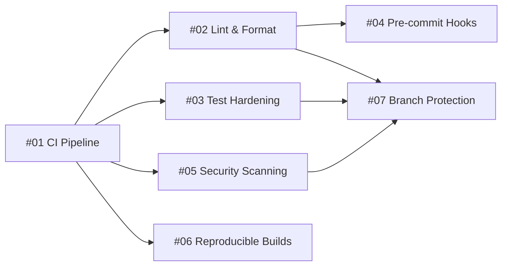

# Go DX Research — Overview

This directory contains 7 issue-ready proposals to harden Forge's developer workflow. Each doc is self-contained with config examples, acceptance criteria, and effort estimates — ready to become a GitHub issue.

## Current State

Forge has:
- A `Makefile` with `build`, `test` (`-race`), `lint` (golangci-lint v2), `fmt` (goimports), `vet`, and `clean` targets
- A minimal `.golangci.yml` enabling 5 linters (errcheck, govet, ineffassign, staticcheck, unused) and 2 formatters (gofmt, goimports)
- No CI pipeline, pre-commit hooks, coverage enforcement, security scanning, release automation, or branch protection

## Issues

| # | Title | Effort | Priority | Depends on |
|---|-------|--------|----------|------------|
| 01 | [CI Pipeline](01-ci-pipeline.md) | S | 1 | — |
| 02 | [Lint & Format](02-lint-and-format.md) | S | 2 | #01 |
| 03 | [Test Hardening](03-test-hardening.md) | M | 3 | #01 |
| 04 | [Pre-commit Hooks](04-pre-commit-hooks.md) | S | 4 | #02 |
| 05 | [Security Scanning](05-security-scanning.md) | S | 5 | #01 |
| 06 | [Reproducible Builds](06-reproducible-builds.md) | M | 6 | #01 |
| 07 | [Branch Protection](07-branch-protection.md) | S | 7 | #02, #03, #05 |

## Dependency Graph

## Execution Order

Issues are numbered by recommended execution order. The critical path is:

1. **#01 CI Pipeline** — foundation; everything else hooks into CI
2. **#02 Lint & Format** — expand linting, switch to gofumpt
3. **#03 Test Hardening** — coverage thresholds, race detection in CI
4. **#04 Pre-commit Hooks** — local gates using tools from #02
5. **#05 Security Scanning** — govulncheck + deadcode in CI
6. **#06 Reproducible Builds** — GoReleaser on tag push
7. **#07 Branch Protection** — require all CI checks to pass on PRs

Issues #02–#06 can be parallelized once #01 lands. #07 should go last since it gates on checks that must exist first.

## Key Decisions

| Area | Tool | Rationale |
|------|------|-----------|
| CI | GitHub Actions | Project already uses `gh` CLI; native integration |
| Linting | golangci-lint v2 | Already in use, expand linter set |
| Formatting | gofumpt | Strict gofmt superset, gopls-integrated |
| Pre-commit | lefthook | Go-native, fast, parallel — no Python/Node deps |
| Coverage | go-test-coverage | Per-file/package/global threshold enforcement |
| Vuln scanning | govulncheck | Official Go team tool, low false-positive rate |
| Dead code | deadcode | Official Go team tool |
| Releases | GoReleaser | Standard Go release tooling, reproducible builds |
| Commit lint | commitlint (Go) | Go implementation, integrates with lefthook |
